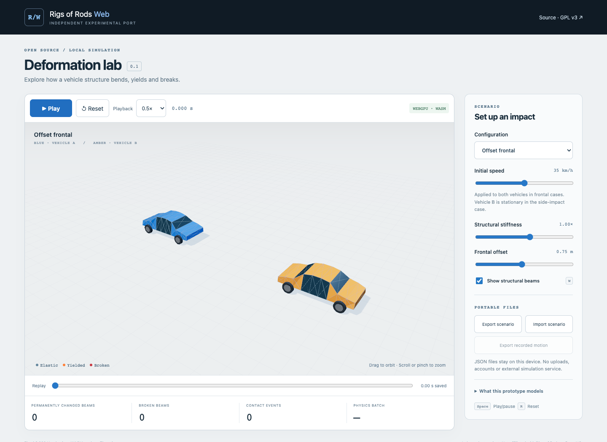

# Rigs of Rods Web

An independent, experimental **browser port of the ordinary-beam portion of Rigs of Rods physics**. C++ runs locally as WebAssembly in a Web Worker. Three.js renders the resulting structure with WebGPU, or its WebGL 2 fallback.

**This is a working early port, not the complete Rigs of Rods simulator.** It does not load existing `.truck` vehicles or RoR maps. The demo uses original synthetic vehicle cages, not licensed car models or measured vehicle properties. It is not a validated crash reconstruction tool.



## What works

- Fixed 0.5 ms physics steps (2,000 Hz), independent of render frame batching.
- RoR-derived normal-beam spring/damping forces, compressive/tensile plastic deformation, yield hardening and breaking.
- New experimental node-to-triangle vehicle contact, swept entry checks, a rigid barrier, and basic optional ground contact.
- Full frontal, offset frontal, side-impact and barrier scenarios.
- Local WASM worker, orbit camera, beam damage colors, pause/reset, recorded-frame scrubbing and JSON import/export.
- Responsive controls and touch orbit/zoom. `Space` plays/pauses, `R` resets and `W` toggles beams when focus is outside a form control.
- Native and actual-WASM tests plus desktop/mobile-layout browser tests.

The source origin and extraction changes are recorded in [upstream/README.md](upstream/README.md). The upstream file is included unchanged for auditing; the desktop application and its dependencies are not built.

## Build and run

Requirements: Node.js 22.12+ (CI uses 24), npm, and [Emscripten SDK](https://emscripten.org/docs/getting_started/downloads.html) **6.0.9**. For native tests, install a C++17 compiler.

```sh
# In your emsdk checkout:
./emsdk install 6.0.9
./emsdk activate 6.0.9
source ./emsdk_env.sh

# In this repository:
npm ci
npm run build:wasm
npm run dev
```

Open the local URL printed by Vite. The `.wasm` file must be served over HTTP(S); opening `index.html` directly does not work. WebGPU requires HTTPS or localhost. Browsers without it can use the WebGL 2 renderer fallback. This first port uses a **single worker with SIMD**, not shared-memory pthreads, so COOP/COEP headers are not required. WASM SIMD must be supported.

```sh
npm run build        # WASM + production static site in dist/
npm run preview     # Serve the production bundle
npm test            # Exercises the real compiled WASM
bash scripts/test-native.sh
npx playwright install chromium
npm run test:browser
```

Set `CHROME_PATH` to a locally installed Chrome executable to test that browser instead of Playwright Chromium. The mobile project emulates an iPhone-sized viewport in Chromium; it is **not an iOS Safari hardware test**.

Linux CI runs the suite with `ROR_TEST_RENDERER=webgl` because its software WebGPU device is unstable. WebGPU was verified locally on macOS Chrome; see [validation details](docs/VALIDATION.md). Add `?renderer=webgl` to the app URL to select the fallback explicitly.

Release archives include the built site and the matching source tree. To share binaries elsewhere, provide the matching complete corresponding source and notices too; see [distribution notes](docs/LICENSING.md).

## Simulation boundaries

The two synthetic cars each have 40 nodes and 204 ordinary beams, with a reinforced central region. Mass, stiffness and yield parameters are illustrative. The demo disables gravity and tire forces to isolate impact response; the wheels are visual markers. The solver supports basic gravity/ground contact for imported fixtures, but no tire, suspension or drivetrain model has been ported.

The contact system is newly written here, **not RoR's production collision implementation**. It has a 15 mm contact skin and limited swept node/face checks. Full edge/edge continuous collision detection, self-collision, persistent manifolds, friction, robust fracture surface topology and complete penetration prevention are still missing. Broken beam markers do not detach rendered panels. Do not use it to infer injury, a real vehicle's crashworthiness or a unique reconstruction.

Changing a control resets the simulation. Scrubbing reads recorded frames; pressing Play after scrubbing starts a fresh simulation. Under heavy load the app slows rather than increasing the physics step. Each demo records up to three simulated seconds.

See [architecture](docs/ARCHITECTURE.md), [file format](docs/FORMAT.md), [validation](docs/VALIDATION.md) and [roadmap](docs/ROADMAP.md).

## Commercial use and GPL

Commercial use is permitted, but **publishing this repository does not automatically permit a proprietary app to link to its WASM API**. A tightly coupled browser integration may form one combined work covered by GPL. A separate repository, worker, domain or iframe is not an automatic exception.

This repository is a usable standalone GPL application. It imports and exports user-selected data files; it has no proprietary host adapter, embedded commercial code, case data, account integration or keys. Any future commercial integration needs a review of the actual boundary. See [the licensing analysis](docs/LICENSING.md).

## License and attribution

GPL-3.0-only for this distribution; see [LICENSE](LICENSE). RoR attribution is preserved in the derived source and [upstream/AUTHORS.md](upstream/AUTHORS.md). New code and synthetic fixtures: Copyright 2026 kareemn. Third-party dependencies retain their own licenses; see [THIRD_PARTY_NOTICES.md](THIRD_PARTY_NOTICES.md).

This project is not affiliated with or endorsed by Rigs of Rods or BeamNG. No upstream vehicle mods, game artwork, trademarks-as-logos, or commercial application source/data are included.
